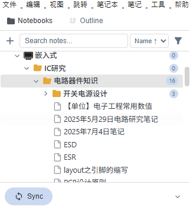
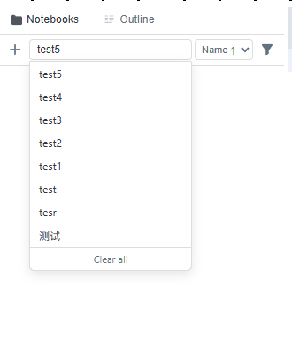
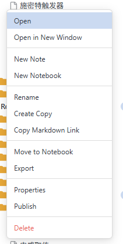

<div align="center">


<h1>Full Notebook View for Joplin</h1>

<p>
  <a href="README_EN.md">English</a> | <b>中文</b>
</p>

<p>
  一个为 <a href="https://joplinapp.org/">Joplin</a> 设计的侧边栏插件，提供类似 Windows 资源管理器的笔记本树形视图，并集成大纲导航、搜索、筛选、导出等生产力功能。
</p>

</div>

---

## 功能截图

<table>
  <tr>
    <td align="center" width="50%">
      
      <br/>
      <sub>笔记本树形视图 — 层级展开与实时高亮</sub>
    </td>
    <td align="center" width="50%">
      
      <br/>
      <sub>大纲导航 — 自动提取 Markdown 标题</sub>
    </td>
  </tr>
  <tr>
    <td align="center" width="50%">
      
      <br/>
      <sub>搜索与筛选 — 支持日期范围与类型过滤</sub>
    </td>
    <td align="center" width="50%">
      
      <br/>
      <sub>右键菜单 — 导出、重命名、移动等完整操作</sub>
    </td>
  </tr>
  <tr>
    <td align="center" colspan="2">
      
      <br/>
      <sub>排除管理与一键同步</sub>
    </td>
  </tr>
</table>


---

## 功能特性

### 笔记本树形视图
- **层级展开/折叠** — 以树形结构浏览所有笔记本与子笔记本，支持一键展开/折叠
- **实时高亮** — 当前打开的笔记在树中高亮显示，并自动滚动到可视区域
- **笔记计数** — 每个文件夹旁显示包含的笔记数量
- **Emoji 图标支持** — 自动识别并显示 Joplin 笔记本的 Emoji 图标
- **待办状态** — 区分普通笔记与待办事项（已完成/未完成不同图标）

### 双栏标签页
- **Notebooks** — 笔记本与笔记的树形导航
- **Outline** — 自动提取当前笔记的 Markdown 标题大纲，点击即可跳转到对应位置

### 搜索与筛选
- **实时搜索** — 支持按关键词快速搜索笔记和笔记本
- **搜索历史** — 自动保存最近搜索记录，支持快捷回溯
- **高级筛选** — 可按类型（笔记/笔记本）、修改日期范围进行组合筛选
- **排除管理** — 可将特定笔记或笔记本加入排除列表，在视图中隐藏

### 右键操作菜单
- 新建笔记 / 新建子笔记本
- 重命名（行内编辑）
- 在新窗口中打开
- 创建副本 / 复制 Markdown 链接
- 移动到其他笔记本
- 导出为 Markdown / HTML / PDF / JEX
- 查看属性 / 发布
- 删除（带二次确认，删除笔记本需输入名称确认）

### 同步与设置
- **一键同步** — 底部集成同步按钮与同步状态/日志面板
- **隐藏标题栏** — 可在设置中隐藏笔记编辑器上方的标题输入框，获得更沉浸的编辑体验

---

## 安装

### 通过 Joplin 插件仓库安装（推荐）

1. 打开 Joplin，进入 **工具 → 选项 → 插件**
2. 在搜索框中输入 `Full Notebook View`
3. 点击安装即可

### 手动安装

1. 手动编译本仓库， 获取 `.jpl` 文件
2. 打开 Joplin，进入 **工具 → 选项 → 插件**
3. 点击 **从文件安装**，选择下载的 `.jpl` 文件

---

## 使用说明

### 打开面板

安装后，插件会在 Joplin 右侧新增一个侧边栏面板。你也可以通过工具栏上的 **树形图标按钮** 切换面板显示/隐藏。

### 快捷键与交互

| 操作 | 说明 |
|------|------|
| 点击 ▶/▼ | 展开或折叠文件夹 |
| 点击笔记名称 | 在编辑器中打开该笔记 |
| 右键点击 | 打开操作菜单（新建、导出、删除等） |
| Outline 标签页 | 点击标题跳转到笔记对应位置 |

### 设置

进入 **工具 → 选项 → Full Notebook View** 可调整：

- **Hide note title bar** — 隐藏笔记标题输入栏

---

## 构建

```bash
# 安装依赖
npm install

# 构建插件（生成 dist/ 与 publish/）
npm run dist
```

构建完成后，`publish/` 目录下会生成 `.jpl` 插件包和 `.json` 清单文件。

---

## 技术栈

- TypeScript
- Joplin Plugin API
- 原生 WebView（Vanilla JS + CSS）

---

## 兼容性

- Joplin **v3.5+**
- 支持 Windows、macOS、Linux

---

## 贡献

欢迎提交 Issue 和 Pull Request！

如果你有任何建议或发现了 Bug，请通过 [GitHub Issues](../../issues) 反馈。

---

## 许可证

本项目基于 [MIT](LICENSE) 许可证开源。
